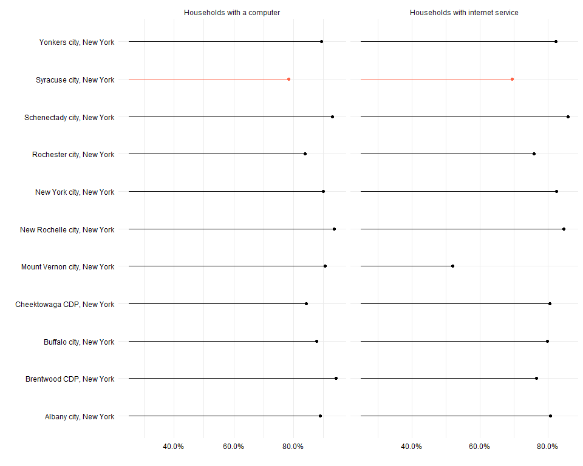
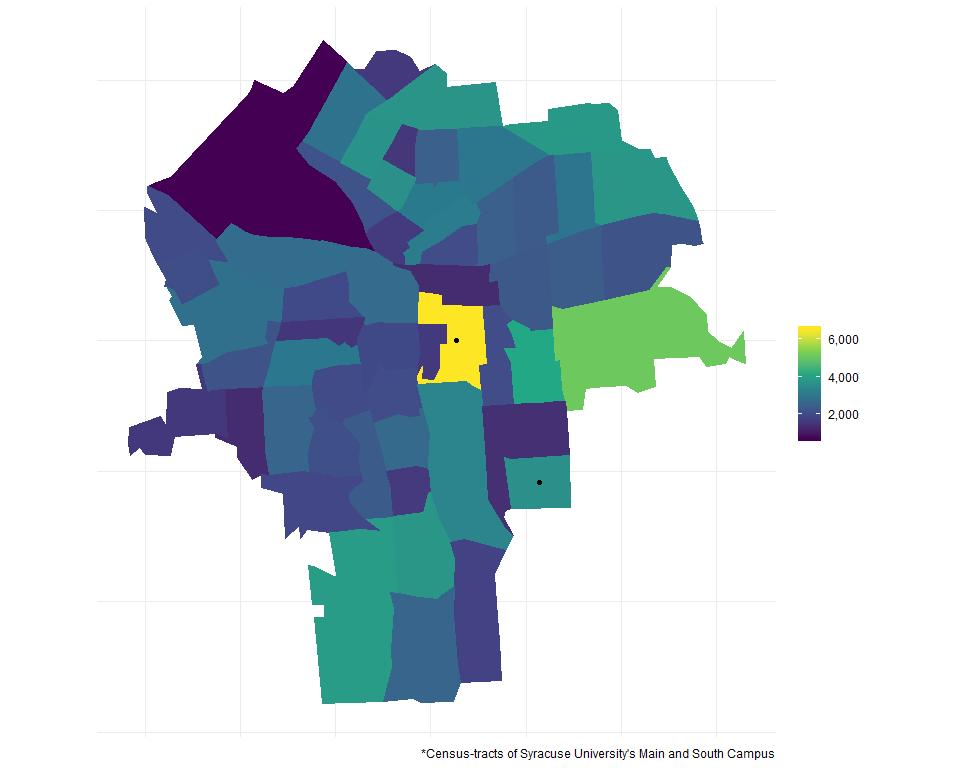

Syracuse Poverty
================

Poverty in Syracuse
===================

Percent of people in poverty in Syracuse since 2011 (ACS 1-yr)
--------------------------------------------------------------

Poverty by city in 2017
-----------------------

Public Transportation History
-----------------------------

Public transportation by city
-----------------------------

Map of public transportation ridership
--------------------------------------

    ## Reading layer `City_Streets_2011' from data source `\\hd.ad.syr.edu\02\c3964a\Documents\Desktop\DataProjects\Syr_poverty\shapefile\City_Streets_2011.shp' using driver `ESRI Shapefile'
    ## Simple feature collection with 5650 features and 50 fields
    ## geometry type:  LINESTRING
    ## dimension:      XY
    ## bbox:           xmin: -76.20455 ymin: 42.98442 xmax: -76.07427 ymax: 43.08618
    ## epsg (SRID):    4326
    ## proj4string:    +proj=longlat +datum=WGS84 +no_defs

Percent public transportation overall
-------------------------------------

Percent of people with computer science or math degrees
-------------------------------------------------------

No schooling by census tract
----------------------------

    ## Reading layer `highway_SYR' from data source `\\hd.ad.syr.edu\02\c3964a\Documents\Desktop\DataProjects\Syr_poverty\shapefile\highway_SYR.shp' using driver `ESRI Shapefile'
    ## Simple feature collection with 313 features and 69 fields
    ## geometry type:  LINESTRING
    ## dimension:      XY
    ## bbox:           xmin: 402638.1 ymin: 4760100 xmax: 411745.1 ymax: 4770180
    ## epsg (SRID):    26918
    ## proj4string:    +proj=utm +zone=18 +datum=NAD83 +units=m +no_defs

    ## Reading layer `Syracuse_TNT_Areas' from data source `\\hd.ad.syr.edu\02\c3964a\Documents\Desktop\DataProjects\Syr_poverty\shapefile\Syracuse_TNT_Areas.shp' using driver `ESRI Shapefile'
    ## Simple feature collection with 8 features and 3 fields
    ## geometry type:  POLYGON
    ## dimension:      XY
    ## bbox:           xmin: 401858.6 ymin: 4759706 xmax: 412459.8 ymax: 4771030
    ## epsg (SRID):    26918
    ## proj4string:    +proj=utm +zone=18 +datum=NAD83 +units=m +no_defs

Less than high school education
-------------------------------

Percentage of people with computers and internet connectivity
-------------------------------------------------------------

Lived in the same house 1 year ago
----------------------------------

### Quantiles

### Percentages

### Unfit properties

    ## Reading layer `9ec2872366974b949bbee2e43047b730_0' from data source `https://opendata.arcgis.com/datasets/9ec2872366974b949bbee2e43047b730_0.geojson' using driver `GeoJSON'
    ## Simple feature collection with 233 features and 14 fields
    ## geometry type:  POINT
    ## dimension:      XY
    ## bbox:           xmin: -76.19794 ymin: 42.99771 xmax: -76.09212 ymax: 43.07647
    ## epsg (SRID):    4326
    ## proj4string:    +proj=longlat +datum=WGS84 +no_defs

Moved into current residence in the past year
---------------------------------------------

